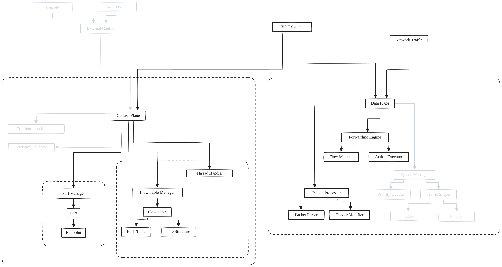

# E-VDE: Extended VDE Switch
- [E-VDE: Extended VDE Switch](#e-vde-extended-vde-switch)
  - [1. Control Plane](#1-control-plane)
  - [2. Data Plane](#2-data-plane)
    - [2.1. Toeplitz Hashing](#21-toeplitz-hashing)
    - [2.2. Packet Processor](#22-packet-processor)
  - [3. Future Work](#3-future-work)



This report details the architecture of an extension of the original [VDE Switch](https://github.com/virtualsquare/vde-2) called E-VDE. The new switch uses multithreading to improve performance and scalability, and it is designed to be extensible and modular.

The new architecture separates concerns between the control plane and data plane, allowing for scalable and efficient network operations.a

As we can see in the diagram above, there is a clear separation between the control plane and data plane. The control plane is responsible for managing the network configuration, while the data plane is responsible for packet forwarding.

The control plane consists of several modules, including the port manager, flow table manager, configuration manager, and statistics collector. These modules work together to configure the network, manage flow tables, collect statistics (eventually), and monitor network performance.

The data plane consists of the packet processor, forwarding engine, queue manager, and traffic shaper (eventually). These modules work together to process incoming packets, forward packets to the appropriate destination, manage packet queues, and shape traffic to meet quality of service requirements.

## 1. Control Plane

The control plane accepts incoming connections from clients on a control socket,
`ctl` in the `vde.ctl` directory, to keep it backward compatibility with the original VDE switch. The control plane is responsible for managing the network configuration, including adding and removing ports, configuring flow tables, and collecting statistics.

The port manager is responsible for managing the ports and the associated endpoints of the switch. Like the original VDE Switch, every connection to the switch is represented by a socket file named `00{port}.{fd}` in the `vde.ctl` directory. The port manager is responsible for creating and deleting these socket files, as well as managing the associated endpoints.

New connections are accepted by the control plane, where the port manager creates a new socket file and associates it with the new connection. The port manager also maintains a list of all active ports and their associated endpoints, which is used by the other modules in the control plane.

The control plane then notifies the data plane of the new connection through a pipe, which triggers the data plane to add the newly created file descriptor to its list of file descriptors to monitor for incoming packets.

The flow table manager is responsible for managing the flow tables of the switch. The flow table manager receives flow table entries from the configuration manager and updates the flow tables accordingly. The flow table manager also provides an interface for querying the flow tables and updating flow table entries. This is where VLAN managing will be implemented. As of right now, the flow table manager is a simple in-memory data structure that maps flow table entries to output ports.

The entire switch is configurable through command line arguments and a json configuration file. The configuration manager is responsible for parsing the command line arguments and configuration file and updating the switch configuration accordingly. The configuration manager will also provides an interface for querying the switch configuration and updating the switch configuration.

## 2. Data Plane

The data plane is responsible for processing incoming packets, forwarding packets to the appropriate destination, managing packet queues, and shaping traffic to meet quality of service requirements (eventually).

It consists of a thread that listens for incoming packets on the ports of the switch and messages from the control plane. When a packet is received, the forwarding engine will calculate the header's **Toeplitz Hash** and use it to determine which thread should process the packet. 

### 2.1. Toeplitz Hashing

The Toeplitz Hash is a hash function that is used to determine which thread should process a packet. The hash function takes as input the source and destination MAC addresses of the packet and outputs a hash value. This hash value is then used to determine which thread should process the packet.

The Toeplitz Hash function is used to ensure that packets with the same source and destination MAC addresses are always processed by the same thread. This is important for maintaining packet order and avoiding packet reordering.

The Toeplitz Hash function is implemented as a simple XOR operation on the source and destination MAC addresses. The hash value is then used to determine which thread should process the packet.

```c

uint32_t toeplitz_hash(const uint8_t *key, size_t key_len, const uint8_t *data, size_t data_len)
{
    uint32_t result = 0;
    size_t bits = data_len * 8;

    for (size_t i = 0; i < bits; i++)
    {
        if (data[i / 8] & (1 << (7 - (i % 8))))
        {
            result ^= ((uint32_t)key[i % key_len] << 24) |
                      ((uint32_t)key[(i + 1) % key_len] << 16) |
                      ((uint32_t)key[(i + 2) % key_len] << 8) |
                      ((uint32_t)key[(i + 3) % key_len]);
        }
    }

    return result;
}

```

The toeplitz hash key can be changed dynamically to allow for load balancing and fault tolerance.

### 2.2. Packet Processor

The packet processor consists of a pool of worker threads that process incoming packets. Each worker thread is responsible for processing packets for a specific "connection", i.e. set of source and destination MAC addresses. When a packet is received by the data plane, the forwarding engine sends a message to the appropriate worker thread to process the packet.

The number of worker threads is fixed. However, the number of worker threads can be changed dynamically to allow for load balancing and fault tolerance.

The packet processor is responsible for processing packets according to the flow table entries and forwarding the packets to the appropriate output port. The packet processor also manages packet queues and shapes traffic to meet quality of service requirements (eventually).

The packet processor is designed to be extensible and modular, allowing for the addition of new packet processing modules and algorithms. This allows for the implementation of new features and optimizations without modifying the core packet processing logic.

Each worker thread has a lock-free ring buffer to store packets that are waiting to be processed. This allows for efficient packet processing and avoids the need for expensive locking mechanisms.

## 3. Future Work

The E-VDE switch is still a work in progress, and there are several areas that need to be improved and optimized. Some of the future work includes:

- VLAN 802.1Q support: the switch currently does not support VLAN tagging and untagging.
- Optimizing the packet processor to improve performance: initial tests show that the packet switching rate is lower than expected, but this is likely due to the lack of optimization in the packet processor.
- A more efficient flow table manager: the current flow table manager is a simple in-memory data structure, but this may not be efficient for large flow tables. Implementing a more efficient flow table manager will improve the performance of the switch.
- Implementing traffic shaping and quality of service features: the switch currently does not support traffic shaping or quality of service features, but these are important for ensuring that the switch can meet the requirements of modern networks.
- Implementing a statistics collector: the switch currently does not collect statistics on network performance, but this is important for monitoring network performance and diagnosing issues.
- Using modules to extend the switch functionality: the switch is designed to be extensible and modular, but this has not been fully implemented yet. Using modules will allow for the addition of new features and optimizations without modifying the core switch logic, like a Console module or a TAP module.